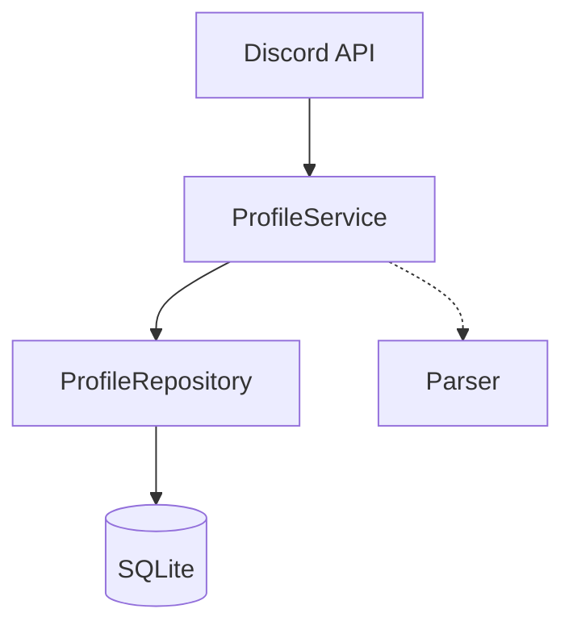

# Profile Synchronization

## Overview

This feature automatically retrieves member profile information from the Discord introduction channel and saves it to the database.

## Architecture



### Components

1. **Discord API Client** (`pkg/discord/client.go`)
   - Retrieves channel messages
2. **Profile Parser** (`pkg/discord/parser.go`)
   - Extracts structured data from messages
3. **Profile Service** (`internal/service/profile.go`)
   - Manages synchronization logic
4. **Scheduler** (`internal/service/scheduler.go`)
   - Controls periodic execution
5. **Profile Repository** (`internal/repository/sqlite/profile.go`)
   - Database operations

## Data Model

```go
type Profile struct {
    ID               string    // UUID
    UserID           string    // User ID (Foreign Key)
    DiscordMessageID string    // Discord Message ID (Unique)
    RealName         string    // Real Name
    StudentID        string    // Student ID
    Hobbies          string    // Hobbies
    WhatToDo         string    // What to do in Jyogi
    Comment          string    // Comment
    CreatedAt        time.Time
    UpdatedAt        time.Time
}
```

## Supported Formats

The parser supports variations like:

### Basic Format

```
⭕本名: じょぎ太郎
⭕学籍番号: 20X1234
⭕趣味: カラオケ、ゲーム、アニメ鑑賞
⭕じょぎでやりたいこと: ゲーム作成
⭕ひとこと: よろしくお願いします！
```

### Flexibility

- Symbols: `⭕`, `○`, `◯` or no symbol
- Separators: `:` (half-width), `：` (full-width)
- Allows spaces or no spaces
- Supports multiple lines

## Deployment and Execution

### Run Once (CLI)

```bash
make sync-profiles
# or
go run ./cmd/sync-profiles -once
```

### Serverless Deployment

It is recommended to deploy to Cloud Functions for operation.
See the [Deployment Guide](./deployment.md) for details.

## Error Handling

- **Discord API Rate Limits**: Max 100 messages/request per channel
- **Parse Errors**: Messages with invalid formats are skipped (logged).
- **DB Errors**: Processed within a transaction, rolled back on failure.
