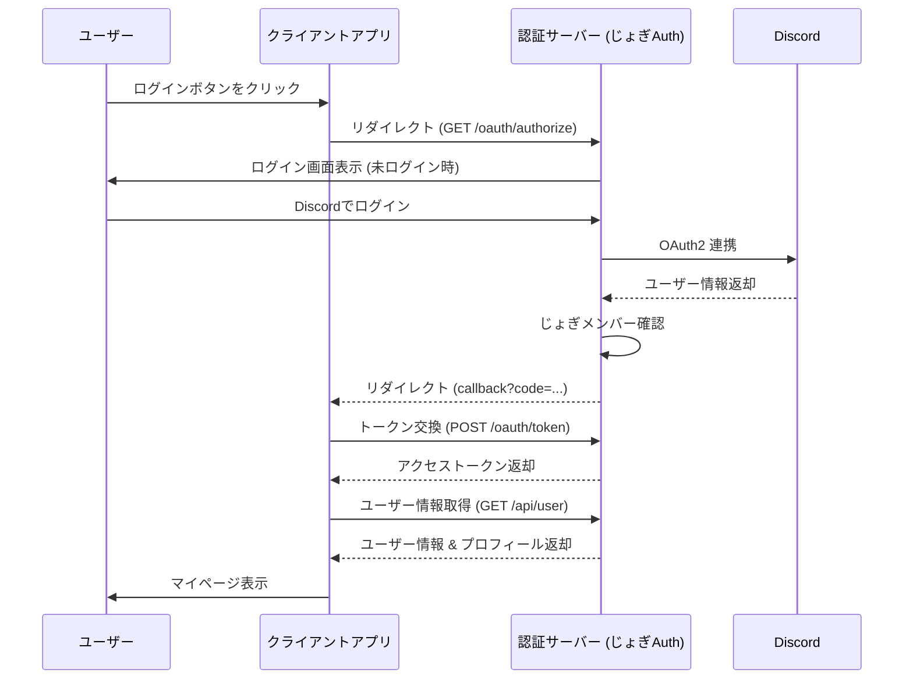

# クイックスタート (クライアント統合)

Next.jsプロジェクトをゼロから作成し、「じょぎメンバー認証」を統合するまでの完全なハンズオンガイドです。
App Router を使用して、セキュアな認証フローを実装します。

## 概要

> [!TIP]
> このリポジトリの `demo-app/` ディレクトリに、このガイドで解説する完全なサンプルコードが含まれています。
> 実装を確認したい場合は、そちらも参照してください。

このガイドで作成するもの：

1. Next.jsアプリケーション
2. ログインボタン (認証サーバーへリダイレクト)
3. コールバックハンドラ (認可コードをトークンに交換)
4. プロフィール表示ページ (取得したトークンでAPIアクセス)

### 認証フロー



## Step 1: Next.jsプロジェクトの作成

まずは新しいNext.jsプロジェクトを作成します。

```bash
npx create-next-app@latest jyogi-client-demo
# 設定はすべてデフォルト(Enter)でOKです
cd jyogi-client-demo
```

## Step 2: 環境変数の設定

プロジェクトのルートに `.env.local` ファイルを作成し、認証情報を設定します。
これらの値は認証サーバーの管理者から取得してください。

```bash
# .env.local
NEXT_PUBLIC_AUTH_SERVER_URL="https://your-auth-server-url.com"
CLIENT_ID="your_client_id"
CLIENT_SECRET="your_client_secret"
REDIRECT_URI="http://localhost:3000/api/auth/callback"
```

## Step 3: ログインボタンの作成

トップページにログインリンクを追加します。
CSRF対策のために `state` パラメータを生成するのがベストプラクティスですが、ここでは簡易化のために固定値を使用します。

`app/page.tsx`:

```tsx
import Link from 'next/link'

export default function Home() {
  const authUrl = `${process.env.NEXT_PUBLIC_AUTH_SERVER_URL}/oauth/authorize` +
    `?client_id=${process.env.CLIENT_ID}` +
    `&redirect_uri=${encodeURIComponent(process.env.REDIRECT_URI!)}` +
    `&response_type=code` +
    `&state=random_state_string`

  return (
    <main className="flex min-h-screen flex-col items-center justify-center p-24">
      <h1 className="text-4xl font-bold mb-8">じょぎアプリ</h1>
      <Link 
        href={authUrl}
        className="bg-blue-600 text-white px-6 py-3 rounded-lg hover:bg-blue-700 transition"
      >
        Discordでログインして利用開始
      </Link>
    </main>
  )
}
```

## Step 4: コールバックハンドラの実装

認証サーバーから戻ってきた時に実行されるAPIルートを作成します。
ここで認可コードとアクセストークンを交換し、Cookieに保存します。

`app/api/auth/callback/route.ts`:

```ts
import { NextResponse } from 'next/server'
import { cookies } from 'next/headers'

export async function GET(request: Request) {
  const { searchParams } = new URL(request.url)
  const code = searchParams.get('code')

  if (!code) {
    return NextResponse.json({ error: 'No code provided' }, { status: 400 })
  }

  // トークン交換リクエスト
  const tokenRes = await fetch(`${process.env.NEXT_PUBLIC_AUTH_SERVER_URL}/oauth/token`, {
    method: 'POST',
    headers: { 'Content-Type': 'application/x-www-form-urlencoded' },
    body: new URLSearchParams({
      grant_type: 'authorization_code',
      code: code,
      redirect_uri: process.env.REDIRECT_URI!,
      client_id: process.env.CLIENT_ID!,
      client_secret: process.env.CLIENT_SECRET!,
    }),
  })

  if (!tokenRes.ok) {
    return NextResponse.json({ error: 'Failed to fetch token' }, { status: 500 })
  }

  const data = await tokenRes.json()
  
  // アクセストークンをCookieに保存 (httpOnly)
  const cookieStore = cookies()
  cookieStore.set('access_token', data.access_token, {
    httpOnly: true,
    secure: process.env.NODE_ENV === 'production',
    maxAge: data.expires_in,
    path: '/',
  })

  // マイページへリダイレクト
  return NextResponse.redirect(new URL('/me', request.url))
}
```

## Step 5: マイページの作成 (保護されたページ)

ログイン後に表示されるページを作成します。
サーバーコンポーネントでCookieからトークンを取得し、認証サーバーのユーザー情報APIを叩きます。

`app/me/page.tsx`:

```tsx
import { cookies } from 'next/headers'
import { redirect } from 'next/navigation'

// APIレスポンスの型定義
type UserProfile = {
  id: string
  discord_id: string
  username: string
  display_name: string
  avatar_url: string
  guild_roles?: string[]
  profile?: {
    real_name?: string
    student_id?: string
    hobbies?: string
    what_to_do?: string
    comment?: string
  }
}

async function getUser(token: string): Promise<UserProfile | null> {
  const res = await fetch(`${process.env.NEXT_PUBLIC_AUTH_SERVER_URL}/api/user`, {
    headers: {
      Authorization: `Bearer ${token}`,
    },
    cache: 'no-store' // 常に最新を取得
  })
  
  if (!res.ok) return null
  return res.json()
}

export default async function MePage() {
  const cookieStore = cookies()
  const token = cookieStore.get('access_token')

  if (!token) {
    redirect('/')
  }

  const user = await getUser(token.value)

  if (!user) {
    return <div>セッションが無効です。再度ログインしてください。</div>
  }

  return (
    <main className="p-24">
      <div className="flex items-center gap-4 mb-8">
        {user.avatar_url && (
          
        )}
        <div>
          <h1 className="text-2xl font-bold">{user.display_name}</h1>
          <p className="text-gray-500">@{user.username}</p>
        </div>
      </div>

      <div className="grid grid-cols-1 md:grid-cols-2 gap-6">
        <div className="bg-white p-6 rounded-lg shadow">
          <h2 className="text-xl font-bold mb-4">アカウント情報</h2>
          <dl className="space-y-2">
            <div>
              <dt className="text-sm text-gray-500">Discord ID</dt>
              <dd>{user.discord_id}</dd>
            </div>
            <div>
              <dt className="text-sm text-gray-500">会員ステータス</dt>
              <dd className="text-green-600 font-bold">有効</dd>
            </div>
          </dl>
        </div>

        {user.profile && (
          <div className="bg-white p-6 rounded-lg shadow">
            <h2 className="text-xl font-bold mb-4">プロフィール (同期済み)</h2>
            <dl className="space-y-2">
              <div>
                <dt className="text-sm text-gray-500">名前</dt>
                <dd>{user.profile.real_name || '-'}</dd>
              </div>
              <div>
                <dt className="text-sm text-gray-500">学籍番号</dt>
                <dd>{user.profile.student_id || '-'}</dd>
              </div>
              <div>
                <dt className="text-sm text-gray-500">やりたいこと</dt>
                <dd>{user.profile.what_to_do || '-'}</dd>
              </div>
            </dl>
          </div>
        )}
      </div>
    </main>
  )
}
```

## その他の言語での実装例

### Python (Requests)

```python
import requests

def get_user_profile(access_token):
    url = "https://your-auth-server.com/api/user"
    headers = {
        "Authorization": f"Bearer {access_token}"
    }
    
    response = requests.get(url, headers=headers)
    
    if response.status_code == 200:
        return response.json()
    else:
        print(f"Error: {response.status_code}")
        return None

# 使用例
profile = get_user_profile("YOUR_ACCESS_TOKEN")
print(profile['username'])
```

### Node.js (Axios)

```javascript
const axios = require('axios');

async function getUserProfile(accessToken) {
  try {
    const response = await axios.get('https://your-auth-server.com/api/user', {
      headers: {
        Authorization: `Bearer ${accessToken}`
      }
    });
    return response.data;
  } catch (error) {
    console.error('Error fetching profile:', error.response?.status);
    return null;
  }
}
```

### Ruby on Rails (Faraday)

```ruby
# app/controllers/auth_controller.rb
class AuthController < ApplicationController
  def callback
    # 1. 認可コードをアクセストークンに交換
    response = Faraday.post("#{ENV['AUTH_SERVER_URL']}/oauth/token") do |req|
      req.headers['Content-Type'] = 'application/x-www-form-urlencoded'
      req.body = URI.encode_www_form({
        grant_type: 'authorization_code',
        code: params[:code],
        client_id: ENV['CLIENT_ID'],
        client_secret: ENV['CLIENT_SECRET'],
        redirect_uri: ENV['REDIRECT_URI']
      })
    end

    unless response.success?
      return redirect_to root_path, alert: '認証失敗'
    end

    access_token = JSON.parse(response.body)['access_token']

    # 2. ユーザー情報とプロフィールを取得
    user_res = Faraday.get("#{ENV['AUTH_SERVER_URL']}/api/user") do |req|
      req.headers['Authorization'] = "Bearer #{access_token}"
    end

    user_info = JSON.parse(user_res.body)
    session[:user] = user_info
    redirect_to dashboard_path
  end
end
```

## エラーハンドリング

APIを利用する際は、以下のエラーコードに対応することを推奨します。

| ステータスコード | 意味 | 対処法 |
| :--- | :--- | :--- |
| `401 Unauthorized` | トークンが無効または期限切れ | ユーザーを再ログインさせるか、リフレッシュトークンを使用してください。 |
| `403 Forbidden` | アクセス権限がない | ユーザーはじょぎメンバーではない可能性があります。 |
| `500 Internal Server Error` | サーバーエラー | 管理者に問い合わせてください。 |