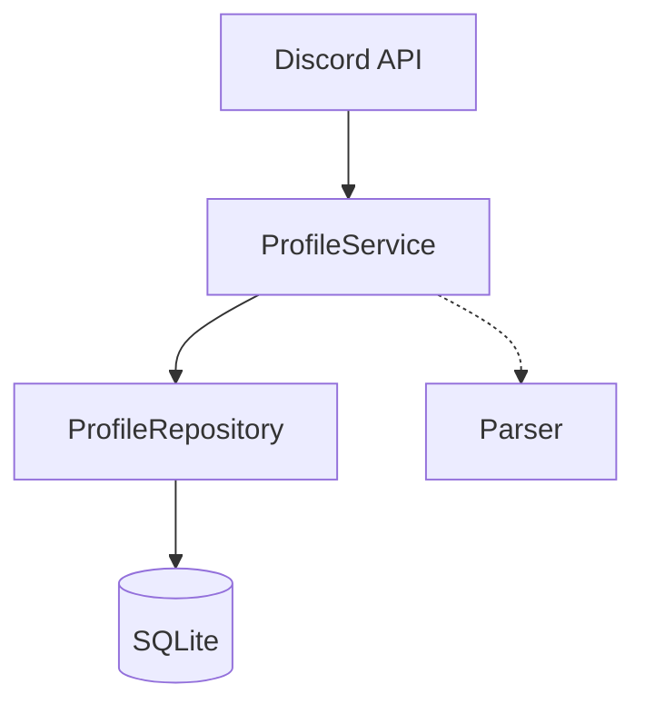

# プロフィール同期機能

## 概要

Discord自己紹介チャンネルからメンバーのプロフィール情報を自動的に取得してデータベースに保存する機能です。

## アーキテクチャ



### コンポーネント

1. **Discord API Client** (`pkg/discord/client.go`)
   - チャンネルメッセージを取得
2. **Profile Parser** (`pkg/discord/parser.go`)
   - メッセージから構造化データを抽出
3. **Profile Service** (`internal/service/profile.go`)
   - 同期ロジックを管理
4. **Scheduler** (`internal/service/scheduler.go`)
   - 定期実行を制御
5. **Profile Repository** (`internal/repository/sqlite/profile.go`)
   - データベース操作

## データモデル

```go
type Profile struct {
    ID               string    // UUID
    UserID           string    // ユーザーID（外部キー）
    DiscordMessageID string    // DiscordメッセージID（一意）
    RealName         string    // 本名
    StudentID        string    // 学籍番号
    Hobbies          string    // 趣味
    WhatToDo         string    // じょぎでやりたいこと
    Comment          string    // ひとこと
    CreatedAt        time.Time
    UpdatedAt        time.Time
}
```

## 対応フォーマット

パーサーは以下のようなバリエーションに対応しています:

### 基本フォーマット

```
⭕本名: じょぎ太郎
⭕学籍番号: 20X1234
⭕趣味: カラオケ、ゲーム、アニメ鑑賞
⭕じょぎでやりたいこと: ゲーム作成
⭕ひとこと: よろしくお願いします！
```

### 柔軟性

- 記号: `⭕`, `○`, `◯` または記号なし
- 区切り: `:` (半角), `：` (全角)
- スペースの有無を許容
- 複数行対応

## デプロイと実行

### 1回のみ実行 (CLI)

```bash
make sync-profiles
# または
go run ./cmd/sync-profiles -once
```

### サーバーレスデプロイ

Cloud Functionsにデプロイして運用することを推奨します。
詳しくは [デプロイメントガイド](./deployment.md) を参照してください。

## エラーハンドリング

- **Discord APIレート制限**: 1チャンネルあたり最大100メッセージ/リクエスト
- **パースエラー**: 無効なフォーマットのメッセージはスキップされます（ログ出力あり）。
- **DBエラー**: トランザクション内で処理され、失敗時はロールバックされます。
